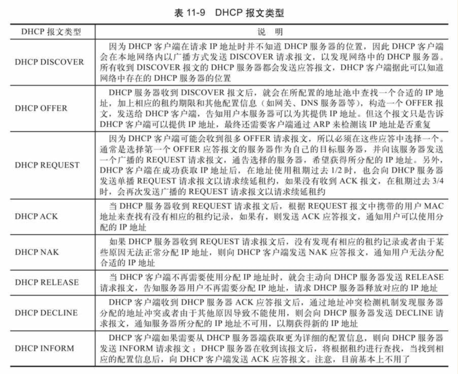
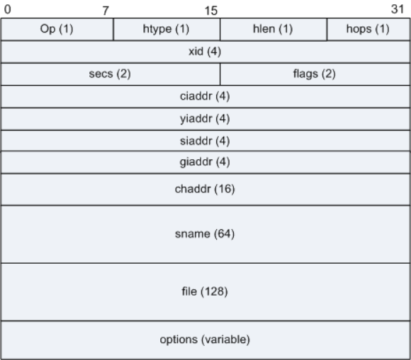

# DHCP报文抓包分析

> 命令行输入ipconfig/release和ipconfig/renew命令，确保捕获DHCP discover和DHCP offer报文。ipconfig/release 是释放租约，ipconfig/renew 是重新申请IP地址。
 
## 1.DHCP报文格式与种类

> DHCP报文是承载于UDP上的高层协议报文，采用UDP67（DHCP服务器发送应答报文）和UDP68（DHCP客户端发送请求报文）两个端口号。

对各个字段的说明：
* **OP** ：占8位1字节。指明该报文的操作类型。

| 字段 | 长度(字节) | 作用 |
| :---| :---: | :----: |
| **OP** *operation*| 1 | 指明该报文的操作类型，请求报文置1，应答报文置2。请求报文：**discover**,**request**,release,inform,decline.应答报文：**offer**,**ack**,nak|
| Htype,Hlen | 各8 | 指明DHCP客户端的硬件（MAC）地址类型及长度，对于以太网，Htype=1，Hlen=6 |
| Hops| 1 | 指明DHCP报文经过的中继数（跳数）。每经过一个中继值+1。客户端置0。
| **Xid**| 4 | 事务ID，由客户端发起请求时选择的一个随机数，用于标识一次IP请求过程。在一次请求中的所有报文Xid相同。|
| Secs | 2 | 由客户端填充，表示从客户端开始获得IP地址或IP地址续借后经过的秒数。在获取IP地址之前该字段为0。 |
| Flags| 2 | 标志位，但仅第一位有意义。标识DHCP服务器应答报文采用单播（置0）还是广播（置1）方式发送。|
| **Ciaddr** *Client IPaddress*| 4 | 指明客户端IP地址。只有客户端是Bound、Renew、Rebinding状态，并且能响应ARP请求时，才能被填充。 |
| **Yiaddr** *Your IPaddress*| 4 | 指明服务器分配给客户端的IP地址，仅存在于offer和ack报文中。|
| Siaddr *Next sever IPaddress*| 4 | 指明下一个为客户端分配IP地址等信息，也即DHCP流程下一个阶段要使用的服务器的IP地址。存在于offer，ack报文中。|
| Giaddr *relay agent IPaddress*| 4 | 表示客户端发出discover报文后经过的第一个DHCP中继的IP地址。如果服务器和客户端不在同一个网络中，那么第一个DHCP中继在转发这个DHCP请求报文时会把自己的IP地址填入此字段。服务器会根据此字段来判断出网段地址，从而选择为用户分配地址的地址池。服务器还会根据此地址将响应报文发送给此DHCP中继，再由DHCP中继将此报文转发给客户端。 若在到达DHCP服务器前经过了不止一个DHCP中继，那么第一个DHCP中继后的中继不会改变此字段，只是把Hops的数目加1。|
| Chaddr *client MACaddress*| 16 |客户端mac地址。此字段与前面的“Hardware Type”和“Hardware Length”保持一致。当客户端发出DHCP请求时，将自己的硬件地址填入此字段。对于以太网，当“Hardware Type”和“Hardware Length”分别为“1”和“6”时，此字段必须填入6字节的以太网MAC地址。 |
| Sname *Sever host name*| 64 | 由服务端选填，DHCP服务器名称（DNS域名格式）。在offer和ack报文中显示。其他报文为0。|
| File | 128 | DHCP服务器为客户端指定的启动配置文件名和路径信息，选填。仅在offer报文中存在。 |
| Options | 可变 | 该字段表示DHCP的选项字段，至少为312字节，格式为"代码+长度+数据"（长度表示的是数据长度。数据4字节，则【长度】值为0x04，它本身占1字节）。DHCP通过此字段包含了服务器分配给终端的配置信息，如网关IP地址，DNS服务器的IP地址，客户端可以使用IP地址的有效租期等信息。 |

Options选项的取值：
* 代码53，**报文类型** *DHCP message type*（数据1字节）。1:discover,2:offer,3:request,4:decline,5:ack,6:nak,7:release
* 代码51，**有效租约期** *IP address lease time*（数据4字节）。
* 代码58，**续约时间** *Renewal time value*（数据4字节）。
* 代码1，**子网掩码** *Subnet Mask*（数据占4字节）。
* 代码3，**默认网关** *Router*（数据长度可变，4*n）
* 代码6，**DNS服务器** *Domain name sever*（数据长度可变，4*n）
* 代码15，主DNS服务器名称 *Domain name*（数据长度可变）
* 代码12，**主机名** *Host name*（数据长度可变）。DHCP客户端主机名称。
* 代码60，**厂商类型标识符** *Vender class identifier*。指明客户端服务提供商，如微软MSFT5.0。
* 代码61，**客户端标识符** *Client identifier*。包括硬件类型（0x01表示以太网）、MAC地址等。
* 代码50，被请求的IP地址 *requested IPaddress*。
* 代码54，服务端标识符 *DHCP sever identifier*。
* 代码81，客户端全限定域名，*Client Fully Qualified Domain Name*。
