# TCP连接建立和释放过程的抓包分析
## 1.TCP数据包抓取过程

通过虚拟机kali执行命令:
> tcpdump -i any *tcp* and host bilibli.com and port 80 -w *http.pcap*

抓取目的或源IP地址为服务器8.134.50.24并且端口号为80的tcp数据包，另存为http.pcap。

执行命令:
>curl http://bilibili.com

截获完整的TCP连接、http请求和回复、TCP断开连接数据包文件。用wireshark将它打开并进行分析。

## 2.TCP报文首部格式

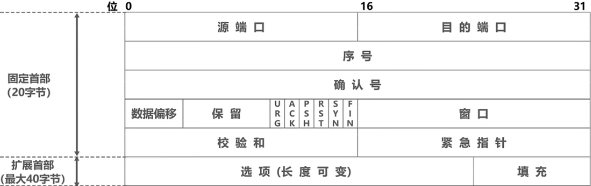

另一种风格的说明图：

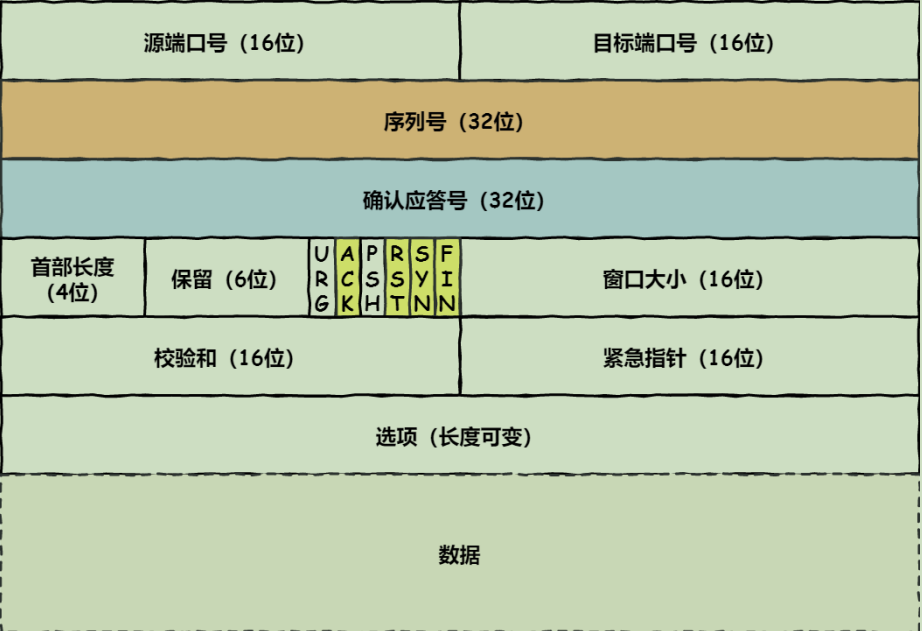

对各个字段的说明：
* **源端口号** *Source Number* 和**目的端口号** *Destination Number*（各占2字节即16位）：分别代表呼叫方和被叫方的TCP端口号。代表发送和接受该TCP报文
  的应用进程。一个端口号与其主机的IP地址可完整地标识一个端点，即套接字socket.
* **序号** *Sequence Number*（占8字节即32位）：取值范围[0,2^32-1]，是TCP数据载荷第一个字节的编号。数据载荷的每一个数据字节都要进行编号，而报文头
  中标识的序号Seq只是第一个数据字节的编号。整个要传送的数据载荷（即字节流）的起始序号必须在连接建立时设置。例如：该TCP报文Seq=160，数据载荷有100字节，
  则最后一个字节编号是259，下一个待传输的TCP报文Seq=260.
* **确认号** *Acknowledgment Number*（占8字节即32位）：取值范围[0,2^32-1]，是指期望收到对方下一个数据段中数据载荷的第一个字节的编号。若Acknumber=n，表明
  前n个字节已经确认收到，希望收到Seq=n的数据。
  > TCP报文的Seqnumber由自己上一个所发的报文Seq值和数据载荷字节数所决定。
  > TCP报文的Acknumber由自己上一个所收到的报文Seq值和数据载荷字节数所决定。
  
  序号和确认号共同用于TCP的差错控制，解决网络包乱序问题和丢包问题。
  
* 数据偏移（占4位）：以4字节为单位，指出TCP报文数据距离TCP报文起始处有多远，即首部长度。因为报文头固定长度为20字节，所以该项最小值为0101；最大值是1111即60个字节。
* 保留*Reserved*（占6位）：为将来应用而保留的6个比特位，全部置0.
* **控制位**（共占6位，各占1位）
  * URG（Urgent Point）**紧急指针**控制位，指出当前报文中是否有紧急数据，置1时表示有紧急数据。
  
  * ACK（**Acknowledgment**）**确认**控制位：指示报文头中确认号字段是否有效。仅当其置1时Acknumber有效。TCP规定，连接建立后所有传送的TCP报文段都应把ACK置1。

  * PSH（Push）**推送**控制位：置1时表示要立即把该报文上交应用进程，置0时则可以先缓存起来。
  
  * RST（Reset）**重置**控制位：用于重置、释放一个异常TCP连接，再建立一个新的TCP连接。置1时起作用。
  
  * SYN（**Synchronization**）**同步**控制位：在连接建立时同步连接序号。当SYN置1时表示这是一个连接请求或连接确认报文。
  
  * FIN（Final）**最后**控制位：用于释放一个链接。该位置1时，表示数据传输完成，发送端没有数据要传输了，要求释放当前连接。但接收端仍可以接收未接收完的数据。
    在正常传输数据时，该位都为0。

* **窗口**（占2字节即16位）：以字节为单位，指出发送次TCP报文的主机上用来存储传入数据端的窗口大小，即发送者此时还可接收的最大字节数。这个字段的值是告诉对方：
  从本数据段的Acknumber值算起，本端允许对端发送的字节数，也就是作为让对方设置其发送窗口大小的依据。
* 校验和*Checksum*（占2字节即16位）：对”首部“，”数据载荷“，”伪首部“进行校验。
* 紧急指针（占2字节16位）：仅当URG置1时有意义。他指出本报文中为紧急数据的字节数。它还指明了紧急数据的末尾在数据载荷中的位置。发送方可以将紧急数据插队到发送缓存的最前面立即发送（即使当前窗口为0），
  当所有紧急数据处理完后，TCP会告诉应用进程恢复到正常操作。
* 可选项Option（长度可变，最长40字节）：可选且长度可变。若没有使用此字段，TCP报文首部是20字节。该项包括：
  * 窗口缩放选项Window Scale Option:调节窗口大小，调节吞吐率。
  * 最大数据段大小MSS MaximumSegmentSize：数据载荷最大长度。
  * 选择性确认SACK permitted：实现选择确认功能（？）。 
  * 时间戳Timestamp：用来计算往返时间RTT；用来处理序号超范围的情况，又称防止序号绕回PAWS。
* 填充（长度可变）：由于选项长度可变，使用填充确保首部字节数能被4整除。因为数据偏移字段是以4字节为单位的。
* 数据Data（长度可变）：由应用层提供或提交给应用层的数据，作为TCP报文的有效载荷。

具体过程见计算机网络第五章运输层解析。

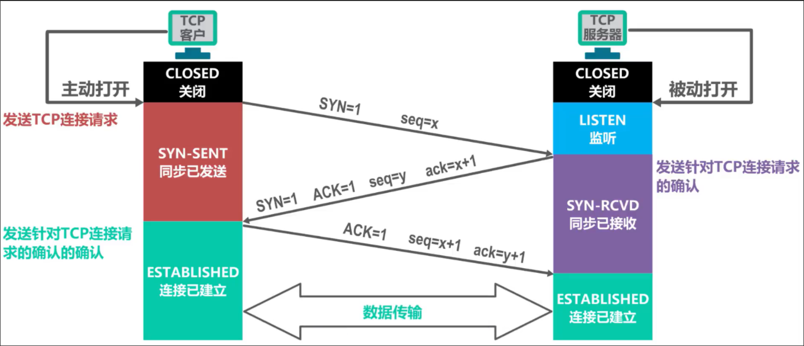

## 3.报文解析

使用wireshark抓包分析，抓到的包展示如下：

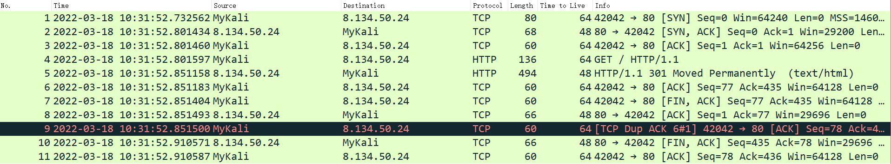

可以明显地看出TCP三报文握手、http数据报运输、四报文挥手的整个过程。

### 3.1TCP连接建立
#### 3.1.1 TCP连接请求报文

分组一如下图所示：
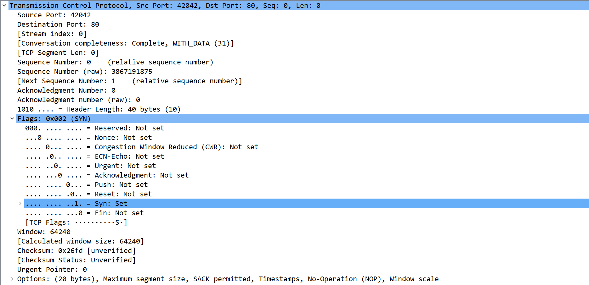
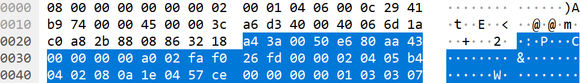

仅对TCP报文进行分析。
该TCP报文共40个字节即320位。其中：
* Src port：42042（0xa43a）
* Dst port：80（0x0050）
* **Seq number**：3867191875（0xe680aa43）这是一个随机生成的序列值，作为数据传输的初始序号。
* Ack number：0（0x00000000）
* 首部长度：0xa即0b1010，10*4字节。
* Reserved：0（0b000000）
* 控制位：
  * **SYN=1**，ACK=0，FIN=0，说明这是一个TCP连接请求报文。
    
发送该报文后，客户端进入**同步已发送**状态。 
接收该报文后，服务端进入**同步已接收**状态。
>至此，客户端知道了自己拥有发送TCP报文的能力。

#### 3.1.2 TCP连接请求确认报文

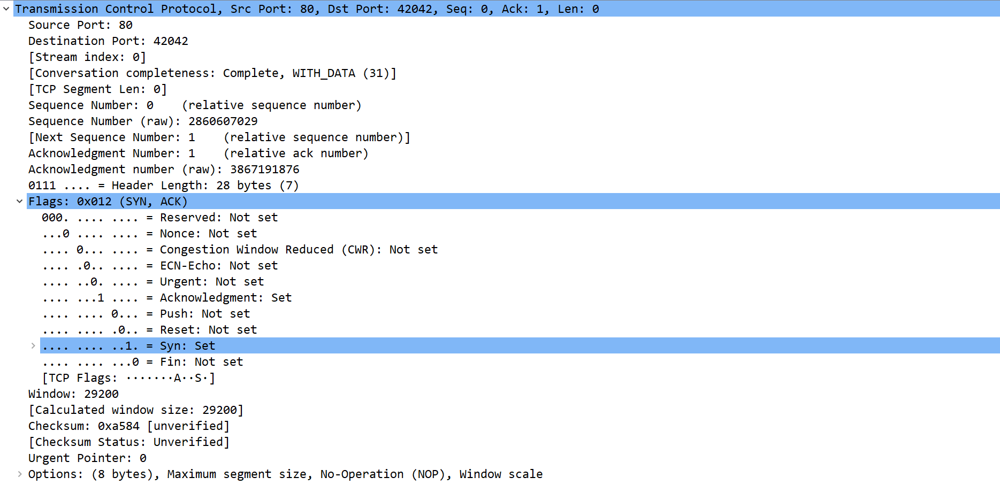

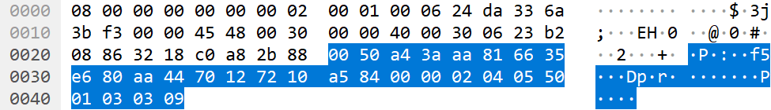

该TCP报文共28个字节即224位。其中：
* Src port：80（0x0050）
* Dst port：42042（0xa43a）
* **Seq number**：2860607029（0xaa816635）这是一个随机生成的序列值，作为服务端选择的初始序号。
* **Ack number**：3867191876（0xe680aa44）这是请求连接报文Seqnumber值+1，表示确认。
* 首部长度：0x1即0b0111，7*4字节。
* Reserved：0（0b000000）
* 控制位：
  * **SYN=1**，**ACK=1**，FIN=0，说明这是一个TCP连接请求确认报文。
  
客户端接收到该报文后，进入**连接已建立**状态。

>至此，服务端知道了自己有发送、接收TCP报文的能力，客户端具有发送TCP报文的能力。

#### 3.1.3 TCP普通确认报文

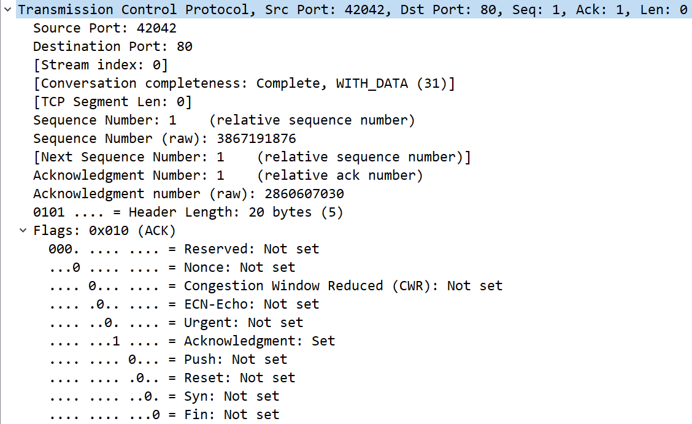

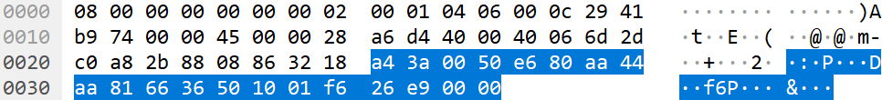

该TCP报文共20个字节即160位。其中：
* Src port：42042（0xa43a）
* Dst port：80（0x0050）
* **Seq number**：3867191876（0xe680aa44）这是客户端所发送的第一个报文Seqnumber值+1，表示这是第二个报文。
* **Ack number**：2860607030（0xaa816636）这是服务端所发请求连接确认报文Seqnumber值+1，表示确认。
* 首部长度：0x5即0b0101，5*4字节。
* Reserved：0（0b000000）
* 控制位：
  * SYN=0，**ACK=1**，FIN=0，说明这是一个普通TCP确认报文。
    
收到该报文后，服务端也进入了**连接已建立状态**。TCP连接成功建立。
  
>至此，客户端知道了自己拥有发送、接收TCP报文的能力；也知道了服务端具有发送、接收TCP报文的能力。
>至此，服务端知道了自己拥有发送、接收TCP报文的能力；也知道了客户端具有发送、接收TCP报文的能力。

### 3.2TCP连接释放

在分析TCP四次挥手释放连接时，我发现了一个问题。客户端向服务端发送连接释放报文（分组7）后，收到的回复报文（分组8）并不是回复分组7的。分组8的Seqnumber
和Acknumber并不与分组7匹配。回复了分组7的报文是连接释放报文分组10。然后客户端回复了一个TCP普通确认报文分组11，连接释放完成。

TCP连接释放只用了三个报文完成，这是怎么回事呢？分组8究竟是回复谁的？

经过查阅，得到的解释是：当一方关闭连接，另外一方没有数据发送时，马上关闭连接；也就将第二步的ack与第三步的fin合并为一步了。这算是性能上的一个优化。

#### 3.2.1 客户端TCP连接释放报文（分组7）

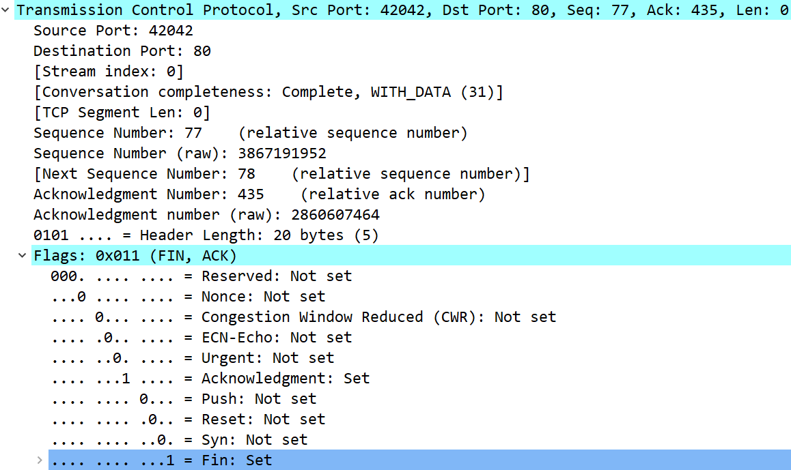

该TCP报文共20个字节即160位。其中：
* Src port：42042（0xa43a）
* Dst port：80（0x0050）
* **Seq number**：3867191952（0xe680aa90）
> 这个值是根据客户端最后一次所发送的TCP报文数据的最后一个字节的序号加1。在本例中，它等于分组4的Seqnumber值3867191876+数据字节数76-1+1。这个值也就是分组5的Acknumber值。
> 而分组6是TCP普通确认报文，其Seqnumber也是这个值。
* **Ack number**：2860607464（0xaa8167e8）
>这个值等于TCP客户端最后一次收到的数据的最后一个字节的序号加1，在本例中，它等于分组5的Seqnumber值2860607030+数据字节数434-1+1，是客户端希望收到的回复报文的Seq号。
* 首部长度：0x1即0b0101，5*4字节。
* Reserved：0（0b000000）
* 控制位：
  * SYN=0，**ACK=1**，**FIN=1**，说明这是一个TCP连接释放报文。说明客户端已经没有数据要发送了，但是还可以接收报文。

>TCP规定普通的TCP确认报文段可以携带数据，但如果不携带数据，则不消耗序号。分组6是客户端对分组5的回复，它不携带任何数据，因此其序号可以在接下来的连接释放报文分组7
> 中继续使用。分组3，4同理。

>TCP规定终止位FIN等于1的报文段即使不携带数据，也要消耗掉一个序号。因此这个序列号被使用了。

#### 3.2.2 服务端TCP连接释放报文（分组10）

* **Seq number**：2860607464（0xaa8167e8）
> 服务端最后一次所发的报文最后一字节数据的序号+1.即分组7的Acknumber.

* **Ack number**：3867191953（0xe680aa44）
>这个值即分组7Seqnumber+1.
* 首部长度：0x1即0b0101，5*4字节。
* 控制位：
  * SYN=0，**ACK=1**，**FIN=1**，说明这是一个TCP连接释放报文。这个报文同时起到了对上一个报文的确认作用。因为服务端此时没有尚未处理的数据，也没有要发送的数据，
  所以将2、3报文合并了。
    
#### 3.2.3 客户端TCP普通确认报文（分组11）

该TCP报文共20个字节即160位。其中：
* Src port：42042（0xa43a）
* Dst port：80（0x0050）
* **Seq number**：3867191953（0xe680aa91）
  > 分组7Seq值+1.
* **Ack number**：2860607465（0xaa8167e9）
  > 分组10Seq值+1.
* 首部长度：0x5即0b0101，5*4字节。
* Reserved：0（0b000000）
* 控制位：
  * SYN=0，**ACK=1**，FIN=0，说明这是一个普通TCP确认报文。

>至此，TCP连接释放完成。

那末，服务端所发的分组8究竟是回复哪一条报文呢？分组8是一条TCP普通回复报文，其Seqnumber值和Acknumber值与分组5完全一致（不带数据的普通回复报文不消耗序号），
因此只能认为它是回复分组4，也就是http-get请求报文的了。